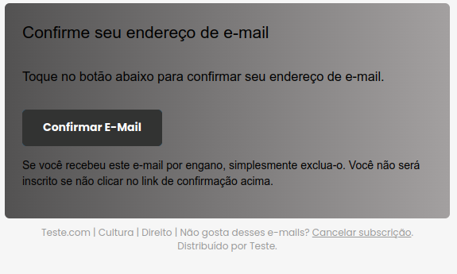
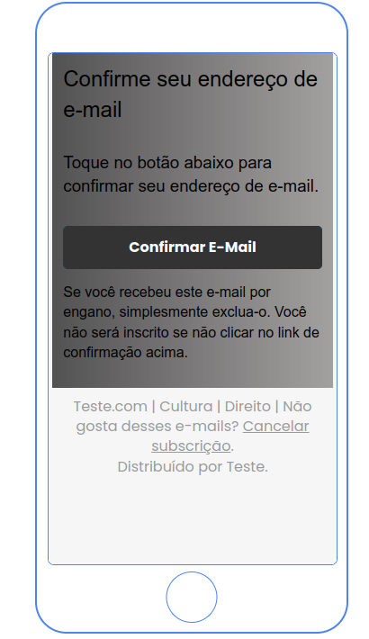

#  Spring Email Service


### Configurando um serviço que envia emails com Spring Boot.


### Desktop
<hr>

<p align="center">
<br>

</p>

### Mobile
<hr>

<p align="center">
<br>

</p>
<hr>

## Tecnologias
 
- [Spring Boot](https://spring.io/projects/spring-boot)
- [Spring MVC](https://docs.spring.io/spring-framework/reference/web/webmvc.html)
- [Spring Email](https://docs.spring.io/spring-framework/reference/integration/email.html)

## Execute

- Clonar repositório git:
  ```
  git clone https://github.com/PauloAlecio/spring-email-service.git
  ```

- Construir o projeto:
  ```
  ./mvnw clean package
  ```

- Configurar credenciais do servidor de email

- Executar:
  ```
  java -jar ./target/spring-email-service-0.0.1-SNAPSHOT.jar
  ```


## Conecte-se comigo
[](https://www.linkedin.com/in/paulo-alécio-da-silva/)

## Estatísticas do GitHub


## Sequência do GitHub

